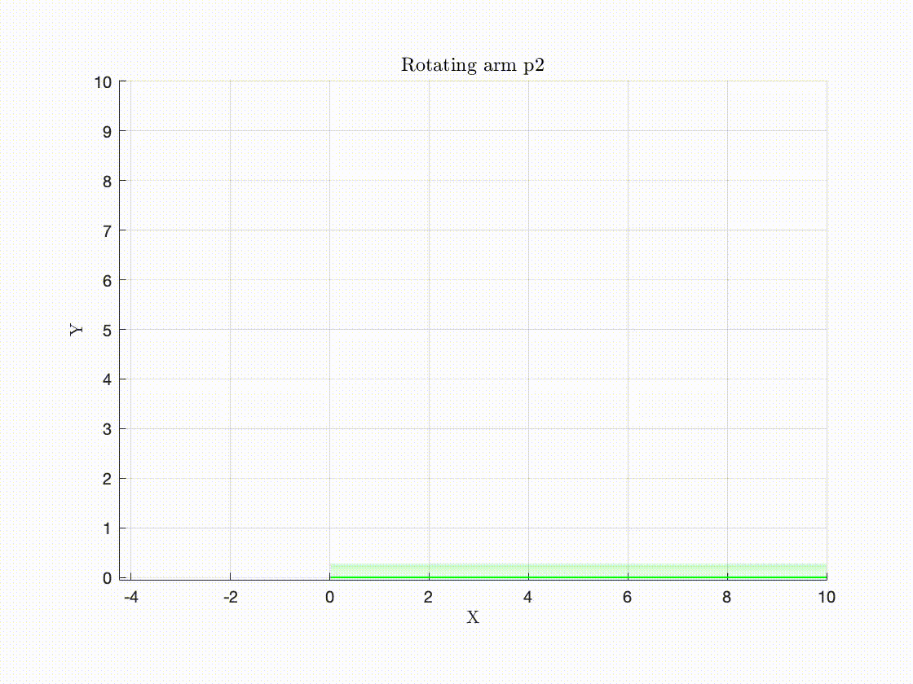
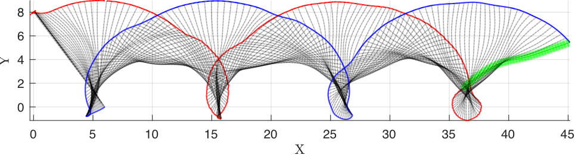
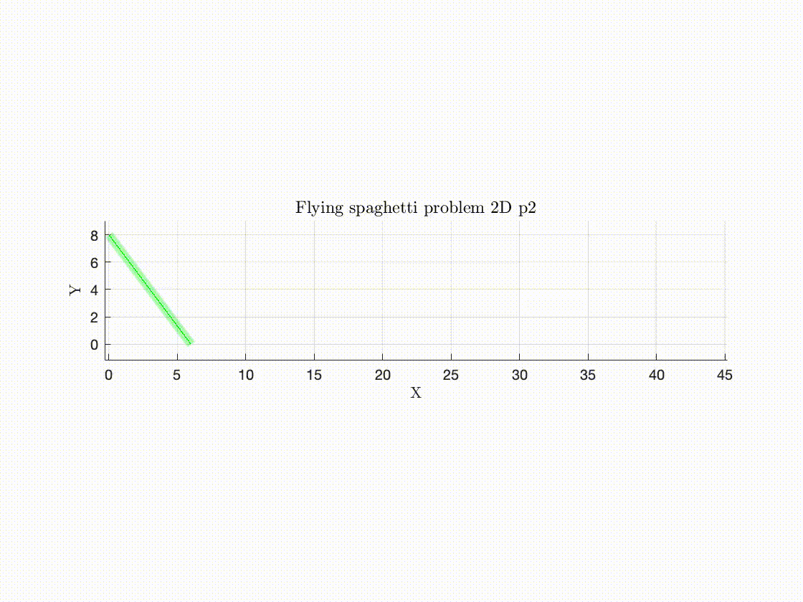

# GEB-diversSimu
Here we discretize equations for geometrically exact beams in various settings. We will consider two Benchmark problems and the problem of feedback control.

At the moment, two benchmark problems have been implemented (use the option problem=0, 1, or 2 in main.m), the feedback control problem is not yet included.

Some pictures:

* Rotating arm:

* Flying spaghetti problem in 3D:

&nbsp;&nbsp;&nbsp;&nbsp;&nbsp;&nbsp; 

&nbsp;&nbsp;&nbsp;&nbsp;&nbsp;&nbsp; 

* Flying spaghetti problem in 2D:

&nbsp;&nbsp;&nbsp;&nbsp;&nbsp;&nbsp; 

&nbsp;&nbsp;&nbsp;&nbsp;&nbsp;&nbsp; 